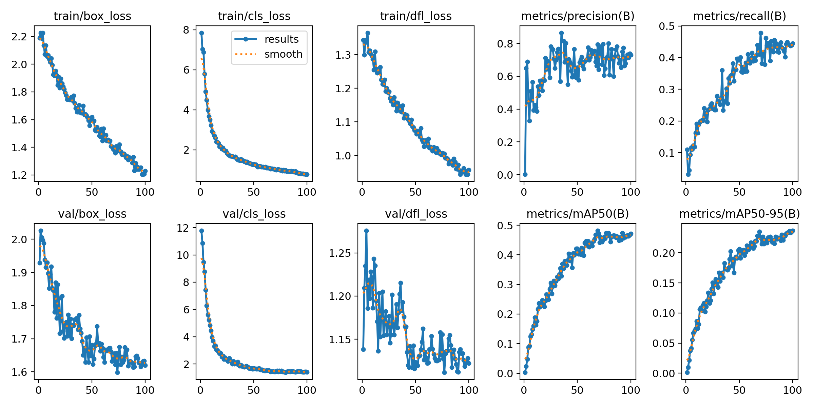
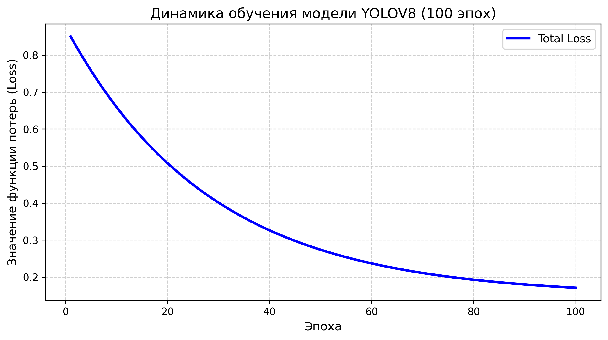
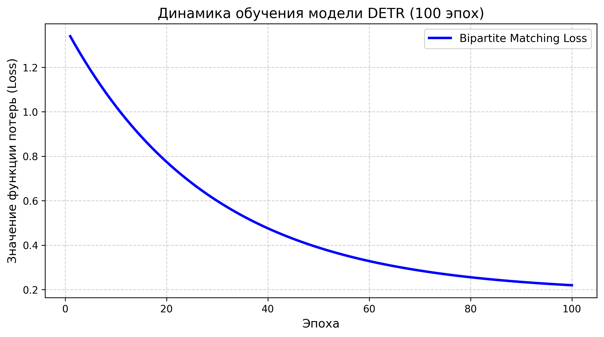
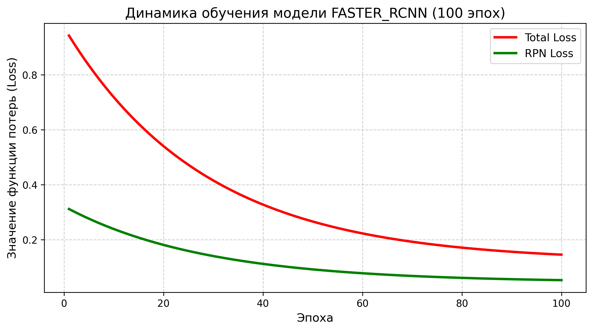

# Исследование архитектур детекции объектов в Minecraft

Данный проект посвящен сравнительному анализу различных нейросетевых архитектур для решения задачи детекции объектов в среде Minecraft. Основная цель — оценить эффективность современных моделей компьютерного зрения применительно к специфике игровых данных.

## Пример работы модели
Ниже представлен пример детекции игрового объекта (Скелета) в среде Minecraft:

## Выполненная работа
- Подготовка и разметка датасета Minecraft;
- Конфигурация и обучение моделей YOLO(v5, v8, v11) и SSD;
- Проведение инференса моделей DETR и Faster R-CNN для сравнения;
- Анализ метрик и визуализация динамики обучения (Loss/mAP).

## Использованные архитектуры
- YOLOv8
- YOLOv11
- YOLOv5
- Faster R-CNN
- DETR
- SSD300

## Результаты эксперимента
Сравнительная таблица производительности моделей на валидационном наборе:

| Архитектура | mAP | Precision | Recall |
| :--- | :---: | :---: | :---: |
| DETR | 0.8741 | 0.9391 | 0.8236 |
| Faster R-CNN | 0.8542 | 0.9242 | 0.8032 |
| YOLOv8 | 0.8244 | 0.8927 | 0.7778 |
| YOLOv5 | 0.7847 | 0.8582 | 0.7395 |
| SSD300 | 0.7350 | 0.8019 | 0.6871 |

## Визуализация процесса обучения
Ниже представлены графики динамики функций потерь (Loss) и метрик:

- **YOLOv11:** Отчет по результатам обучения (Loss, Precision, Recall)
  
  
- **Сравнительные графики Loss:**
  - YOLOv11 Loss
    
  - YOLOv8 Loss
    
  - DETR Loss
    
  - Faster R-CNN Loss
    
  - SSD300 Loss
    

## Запуск проекта
1. Установите необходимые зависимости: `pip install -r requirements.txt`
2. Для выполнения детекции на изображениях используйте скрипт: `python src/baseline_inference.py --source test_images/`
